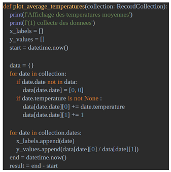

= Présentations des compétences BUT
:toc:

== Compétence 1 : Réaliser un développement d'application
Cette compétence consiste à être capable de développer des applications informatiques simples, partir des exigences et aller jusqu'a une application complète, et se spécialiser sur un ensemble de supports avec un suivi qualitatif.

=== Réalisation
Pour travailler cette compétence, j'ai pu créer une application mobile en répondant à un besoin client lors d'une SAE (3.01).
Le lien du github relatif au projet de cette SAE : https://github.com/Falsimane/SAE-ALT-S3-Dev-22-23-STDS-3B-Equipe-4

== Compétence 2 : Optimiser des applications informatiques
Cette compétence consiste à être capable d'appréhender et de construire des algorithmes, de sélectionner les algorithmes adéquats pour répondre à un problème donné, et analyser et optimiser des applications.

=== Réalisation
J'ai effectué un TP à l'IUT de Blagnac. Le but était d'optimiser un programme de récolte de données. Les fonctions de recherches étaient pas optimisées, il fallait les optimiser. Dans ce cas j'ai utilisation des dictionnaires en python.

Code de la fonction de recherche : +

== Compétence 3 : Administrer des systèmes informatiques communicants complexes
Cette compétence consiste à être capable d'installer et configurer un poste de travail, déployer des services dans une architecture réseau, et faire évoluer et maintenir un système informatique communicant en conditions opérationnelles.

=== Réalisation
Pour travailler cette compétence, j'ai pu réaliser un TP à l'IUT de Blagnac. L'objectif de ce TP était d'installer et configurer une architecture réseau à l'aide du logiciel Cisco Packet Tracer qui permet de simuler une architecture réseau. Pour cette configuration, il m'a donc fallu configurer un serveur DNS, un point d'accès WFIF du LAN, et un serveur DHCP.

Architecture réseau : +

== Compétence 4 : Gérer des données de l’information
Cette compétence consiste à être capable de Concevoir et mettre en place une base de données à partir d'un cahier des charges client, Optimiser une base de données, intéragir avec une application et mettre en oeuvre la sécurité, et administrer une base de données, concevoir et réaliser des systèmes d'informations décisionnels.

=== Réalisation
J'ai effectué un TP à l'IUT de Blagnac pour pouvoir travailler cette compétence, le but était de creer une architecture d'une base de données, en schéma relationnel.

Schéma relationnel : +

== Compétence 5 : Conduire un projet
Cette compétence consiste à être capable d'identifier les besoins métiers des clients et des utilisateurs, appliquer une démarche de suivi de projet en fonction des besoins métiers client et des utilisateurs, et participer à la conception et à la mise en oeuvre d'un projet système d'information.

Pour travailler cette compétence, j'ai pu créer une application mobile en répondant à un besoin client lors d'une SAE (3.01).
Des issues ont été créées pour permettre de s'organiser dans l'équipe.
Le lien du github relatif au projet de cette SAE : https://github.com/Falsimane/SAE-ALT-S3-Dev-22-23-STDS-3B-Equipe-4

== Compétence 6 : Travailler dans une équipe informatique
